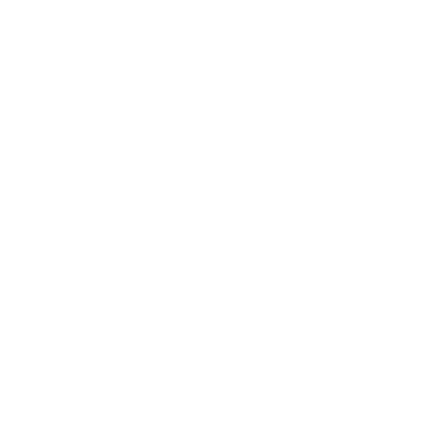

  # My Name is Tito

  
  
  
  
  
  

   

  
   
  
  
   
   

  <table cellpadding="10" cellspacing="0">
    <tr>
      <td align="center">
        <a href="https://octo-ring.com/p/mynameistito/prev" style="text-decoration: none; color: #8b949e;">←</a>
      </td>
      <td align="center">
        <a href="https://octo-ring.com/p/mynameistito/random" style="text-decoration: none; color: #8b949e;">○</a>
      </td>
      <td align="center">
        <a href="https://octo-ring.com/p/mynameistito/next" style="text-decoration: none; color: #8b949e;">→</a>
      </td>
    </tr>
  </table>

  <a href="https://octo-ring.com/" style="text-decoration: none; color: #6e7681; font-size: 10px; letter-spacing: 1px;">octo ring</a>

